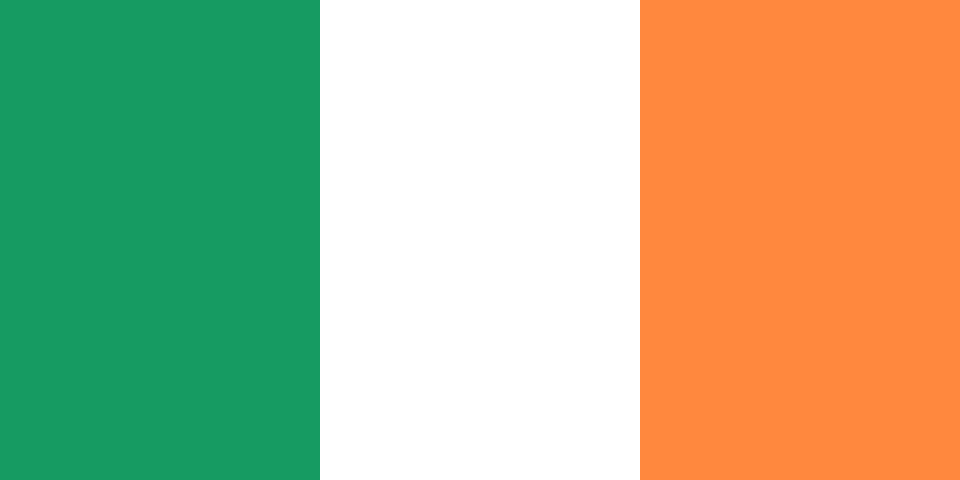
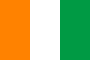
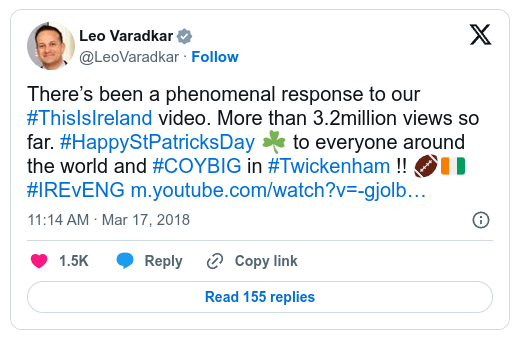

+++
title = 'A Banner of Green, White, & Gold?'
date = 2025-10-23T22:51:58+01:00
tags = ['ireland', 'vexillology', 'pedantry']
+++

## The Importance of Orange
You probably don't need me to tell you that the flag in the above image is the national flag of Ireland.
You also probably don't need me to tell you that the colours in that image are green, white, & orange.
However, you may have heard people referring to the colours of the flag as "green, white, & orange" before, or possibly even people "correcting" those who describe the final stripe as "orange" to say "gold", and you may therefore wonder: "is the flag is actually, officially, green, white, & gold?"

The simple answer is **no**: the flag is green, white, & orange.
This is specified in the Constitution of Ireland (*Bunreacht na hÉireann*), which specifies only that "the national flag is the tricolour of green, white and orange"[^1], and in the Department of the Taoiseach's guidelines on *The National Flag*[^2], which goes into further detail on the dimensions of the flag and the history behind it.

This is not just a matter of semantics, the meaning of the colour *orange*, specifically, is important: the green of the flag represents Irish Catholics, 
the orange Irish Protestants, and the white represents peace between these two long-conflicting groups.
The Young Irelander, Thomas Francis Meagher, who is perhaps the most notable early adopter of the tricolour described its symbolism as follows[^2]:
> The white in the centre signifies a lasting truce between Orange and Green and I trust that beneath its folds the hands of Irish Protestants and Irish Catholics may be clasped in generous and heroic brotherhood.

Thus, to refer to the flag as "green, white, & gold" is not only incorrect, but also misses the entire point of the flag.
While "gold" is often used with poetic license (presumably partly because, famously, nothing rhymes with "orange"), often those referring to the orange of the flag as "gold" are doing so in a sectarian attempt to erase Irish Protestants from the flag.
The Department of the Taoiseach's publication *The National Flag*[^2] condemns this strongly:
> Sometimes shades of yellow or gold, instead of orange, are seen at civilian functions. This is a misrepresentation of the National Flag and should be actively discouraged.

> Down to modern times yellow or gold has occasionally been used instead of orange, but this substitution destroys the symbolism of the National Flag.

## Pedantry
### *Glas* or *Uaine*; *Oráiste* or *Flannbhuí*?
The only thing more annoying than a pedant is a confidently incorrect pedant, and there are many who are incorrectly pedantic about the Irish flag.
The most prevalent form of incorrect pedantry is what I have discussed above: the incorrect insistence that the orange stripe of the flag is in fact gold.
However, there is ever-greater scope for pedantry regarding the national flag in the Irish language, as the terms used to describe the colours of the flag in the Constitution are not as simple as "green" and "orange":
thus, someone who incorrectly insists that the colours of the flag are *glas, bán, agus órga* (green, white, and gold), could arguably be said to be wrong about not just one, but two colours of the flag.

The Irish text of Article 7 of the Irish Constitution[^1] is as follows (translation my own, and very literal):
> An bhratach trí dhath .i. uaine, bán, agus flannbhuí, an suaitheantas náisiúnta. 

> The banner of three colours, i.e., vert, white, and blood-yellow, is the national standard.

To be clear, this translation is overly literal and is not to be considered the intended translation of those words.
The chromonyms used in the Constitution are old-fashioned and unusual by modern standards, but are also subtly distinct from the more common words used to describe similar colours.

"Green" in Irish is most commonly referred to as *glas*, but the Constitution uses the word *uaine*; I've chosen to translate the word *uaine* as *vert* in an attempt to emphasise the heraldic sense of the word, but a better translation would likely be "vivid green".
*Glas* is typically used to mean the green or grey of natural and living things, like the green of grass & trees, but also the grey of animals or the sky[^3];
*uaine*, on the other hand, is a more vivid or unnatural green, like that of painted or dyed items, like flags or clothing.

While *oráiste*, a Romance loan word[^4], is the more common word for "orange" in modern usage, *flannbhuí* is a more traditional term, constructed from the words *flann* (blood-red) and *buí* (yellow).
Unlike *glas* and *uaine*, I don't think there is any distinction between the colours to which *oráiste* and *flannbhuí* refer, the distinction between the words being purely a matter of vocabulary.

I had a teacher in the Gaeltacht once correct those of us who referred to the flag as *glas*, and said that the flag is not *glas* but *uaine*[^5], a correction which I too have issued in the past as a "fun fact", and indeed the Constitution describes the flag as *uaine* instead of *glas*;
however, I've made reference to the Department of the Taoiseach's *The National Flag* in this post, the Irish text of which refers to the flag as *glas* and *oráiste* except when quoting the Constitution.
Clearly, the authors of that guideline were of the opinion that *uaine* is simply a poetic term for the particular shade of *glas* in the flag, and that *flannbhuí* was simply an older term equivalent to *oráiste*.
I will defer to the authority of the Department of the Taoiseach on this, as they are no doubt both more qualified than me in vexillology and in the Irish language, and I would say that although the Constitution says *uaine, bán, agus flannbhuí*, *glas, bán, agus oráiste* is just as correct.

### The Flag of the Ivory Coast
The final bit of vexillological pedantry to which I wish to object in this blogpost is when people accuse others, typically their political enemies, of ignorantly flying the flag of the Ivory Coast (*Côte d'Ivoire*), which is rather similar to the Irish flag, being a tricolour of orange, white, & green.
While this mistake does occur from time to time, I wish to argue here in defence of those accused of making this mistake that, often, the flag in question cannot be described as an Ivory Coast flag, but as an Irish flag displayed in an unusual, or perhaps reversed, manner.

Indeed, this mistake has happened on several notable occasions in the past, such as when the then-Taoiseach Leo Varadker[^6] posted a tweet in which he used the Ivory Coast flag instead of the Irish flag[^7].

Typically, when someone is accused of displaying an Ivory Coast flag, it's done by a political rival in an effort to make their opponent seem stupid and unpatriotic:
for this reason, I will refrain from showing any examples of what I would consider to be a false accusation of the use of the Ivory Coast flag here, as I don't want to give the impression that I am endorsing either of the political groups in question in whatever example I could include.
There are two important points I wish to make on this matter:
1. **The flag of the Ivory Coast is not simply a reversed Irish flag**: the Irish flag has a 1:2 aspect ratio, being twice as long as it is tall[^2], while the flag of the Ivory Coast has a 2:3 aspect ratio, more common among national flags[^8].
2. **Displaying a flag backwards does not change the nation which it represents:** even if the flag of the Ivory Coast and the flag of Ireland had identical dimensions and were simply mirror images of one another, holding an Irish flag backwards would still not transform it into an Ivory Coast flag[^9], as the staff side of the flag would likely still be identifiable and be green.
While the guidelines in *The National Flag*[^2] say the flag should be displayed with the green on the left of the observer when hung horizontally, this doesn't mean that an Irish flag displayed with the orange on the observer's left is a different flag: it's just an incorrectly displayed Irish flag.

In conclusion, vexillological pedants are often not even correct about their pedantry, although I don't feel that being correct would make their "corrections" much less irritating.
It's also worth noting here that the tricolour used my Meagher had the orange stripe on the staff side, like the Ivory Coast flag, and the Constitution of Ireland does not specify a colour order or aspect ratio (although green, then white, then orange is implied).

[^1]: Article 7, Constitution of Ireland. https://www.irishstatutebook.ie/eli/cons/en/html
[^2]: Department of the Taoiseach, 2018. *The National Flag*. https://www.gov.ie/en/department-of-the-taoiseach/publications/the-national-flag/
[^3]: From what I can tell as a non-native speaker of Irish, the use of the word *glas* to mean "grey" is usually in older or poetic usage; the more common word for "grey" is *liath*.
[^4]: eDIL s.v. “oráitse, oráiste.” eDIL – Electronic Dictionary of the Irish Language. https://dil.ie/33937
[^5]:  Curiously, he didn't issue a similar correction for description of the orange as *oráiste* instead of *flannbhuí*; I presume he considered *uaine* to mean something distinct from *glas*, whereas he considered *flannbhuí* to be a synonym for *oráiste*.
[^6]: I believe that he writes his own tweets (or at least *did*) and does not have them ghost-written by a social media manager because only a boomer of his vintage would scroll through the emoji section of the keyboard visually searching for the emoji he wants to use instead of using the search feature to search for the "Ireland" emoji, which would both be far more convenient and preclude the possibility of this sort of mistake occurring.
[^7]: The esteemed & august reputable source that is the Irish Mirror: https://www.irishmirror.ie/sport/rugby-union/taoiseach-leo-varadkar-ridiculed-after-12206028
[^8]: To be charitable to Varadker, this distinction makes his mistake more understandable, as in emoji form, the 1:2 aspect ratio of the Irish flag is not honoured, and instead is displayed in a 2:3 ratio, so the Ivory Coast flag really is just a reversed Irish flag: compare 🇮🇪 versus 🇨, if those emojis render correctly in your browser.
[^9]: Although this has been done in the past, in a pinch: https://www.independent.ie/sport/other-sports/athletics/quick-thinking-irish-fans-come-to-the-rescue-of-victorious-ivory-coast-star-at-world-indoor-athletics-championships/36669933.html.
