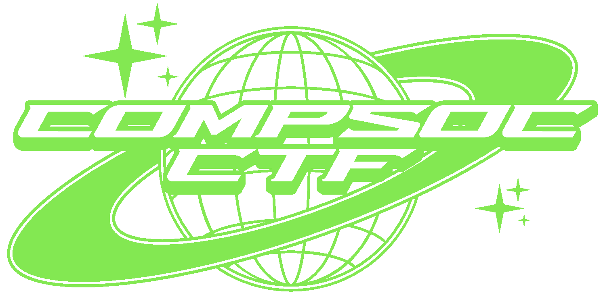

+++
title = 'Galway CompSoc CTF 2025'
date = 2025-02-01T20:10:39Z
draft = false
+++



## Introduction
The University of Galway's Computer Society ran its third annual Capture the Flag this year on St. Brigid's Day (the first of February), with this year being a landmark year as we ran the CTF on our own servers and using our own challenges that we designed in-house.
In previous years, we had outsourced the challenge design & hosting to [Zero Days CTF](https://zerodays.ie/), but this year decided instead to undertake the (unsurprisingly difficult) task of building everything from the ground up, including the challenge design and hosting.

In this blogpost I want to give an overview of the challenges designed by me, how they worked, and the ways in which could beat them.
There were approximately 30 challenges overall, 7 of which I designed or implemented.

## The Challenges

### PWN
My three PWN challenges were originally designed for an interactive exhibit at CompSoc's stand at the University of Galway's Societies Day, but were re-purposed for our CTF to give a greater variety of PWN challenges. 
We already had three phenomenal PWN challenges (designed by one of our system administrators, Martin Klačer), but we decided to include the SocsDay challenges as well to cater to a greater range of skill levels.

The source code (but not the flags used for the CTF) were already [publicly available on my GitHub](https://github.com/0hAodha/compsoc_hacking_challenges), but these challenges have been made in such a way that being able to see the source code isn't particularly helpful for solving the challenge.
The PWN challenges were all ran in Docker containers which exposed a certain port and used [`socat`](https://linux.die.net/man/1/socat) to fork a process and execute the challenge executable upon connection to that port.
Since my challenges involved circumventing restricted environments to execute arbitrary commands, I ran my Docker containers with read-only file systems to prevent any tampering.[^1]

#### Two Letters
> Read the contents of the file `/flag.txt` using only 2-letter commands. <br>
> `nc 142.203.18.3 10009`

This challenge was implemented as shell script which accepted arbitrary user input and evaluated it, provided that entire input string was precisely two characters long:

```shell
#!/bin/bash
# Read the contents of the file flag.txt using only 2-letter commands

echo Read the contents of the file flag.txt using only 2-letter commands

while true; do
    echo -n "$ "
    read input

    if [ ${#input} -eq 2 ]; then
        eval "$input"
    else
        echo "Command is not 2 characters!"
    fi
done
```

To be clear, the *entire* command string including arguments must be two characters in length, not just the command itself; the command `dd if=flag.txt of=/dev/stdout` would not work, as everything must be two characters in total, not just the program name.
As far as I'm aware, there's no possible way to provide an argument to a command for this challenge, as shell commands and arguments must be at least one character in length and separated by at least one whitespace character: the shortest possible series of command string with arguments would have to be three characters in length.
Therefore, the crux of this challenge is to escape the restricted environment to an environment wherein arbitrary commands, or at least arbitrary read commands, can be executed.

I am aware of two potential solutions for this challenge, but I'm sure there are more (if you think of one, please do let me know!).
The former was the one I had in mind when designing the challenge, the latter being one I came up with afterwards:
- {} Run the command `sh` to spawn a new, unrestricted shell and use any standard command of your choice to print the contents of `flag.txt`, e.g., `cat`. {}
- {} Launch a text editor such as `vi`, `ex`, or `ed` depending on what's available on the system in question. Then, the flag file can be opened by running the in-editor command `:e flag.txt` (if `ex` or `ed` is used, you'll have to print the first line by running the in-editor `p` command, if `vi` is used, the file contents will be printed automatically). {}

#### Squeal
> This script accepts the name of an artist and checks if they are currently in the Billboard Top 10 table in our database, e.g. Sabrina Carpenter.

This challenge is implemented as another shell script which accepts user input in a shell-like prompt.
However, unlike `2l.sh`, this script performs absolutely no input sanitisation and is deliberately written in such a way as to be extremely vulnerable to SQL injection:

```shell
#!/bin/sh
# Script that accepts the name of an artist and checks if they are currently in our Billboard Top 10 database

echo "This script accepts the name of an artist and checks if they are currently in the Billboard Top 10 table in our database, e.g. Sabrina Carpenter"

while true; do
    printf "Enter an artist's name: "
    read input 

    sqlite3 database.db "SELECT * FROM singles WHERE artist = '$input'"
done
```

One of the difficult aspects of this challenge is figuring out what other tables are in the database, as there is no standard SQL command to list all the tables in the database.
Therefore, it would be helpful to know what kind of SQL database is in question; I hinted the type of SQL database by describing it as a ``light database'' in the challenge the description --- SQLite being the implementation used.
The fact that the database is an SQL database is a fairly obvious thing to guess for a CTF, but it too is hinted at by the challenge title being "Squeal".
This is probably the challenge of mine that is most simplified by seeing the source code, as it tells you both the database implementation and how the query is structured.
The intended solution was as follows:
- {} Find out what other tables are in the database by injecting a command to list the tables such like:  `'; SELECT name FROM sqlite_master WHERE type='table'; --`, which reveals there's another table in the database named `flags`, deliberately named to be as guessable as possible.
Then, simply inject another command like `'; SELECT * FROM flags; --` which reveals the contents of the `flags` table. {}

Again, there are probably more ways to do it.
Since the challenge was originally created in September 2024, the Top 10 singles table was woefully out of date, and was probably about 50% Sabrina Carpenter songs.
One of the entries in the Top 10 table was a song by an artist named "KAROL G", of whom I have personally never heard and whose name is stylised in all caps, which unfortunately acted as a bit of an accidental red herring as some people entered the string "KAROL G" as the flag as it stood out if you selected all names from the `singles` table, presumably also having never heard of that artist.

#### Approved
> Read the contents of flag.txt. You can only use commands in the approved list. <br>
> Approved commands:
> - `ls`
> - `pwd`
> - `whoami`

Similar to `2l.sh`, seeing the source code for this challenge doesn't help much with solving it, except for one small detail:
```perl
#!/usr/bin/env perl
# Read the contents of flag.txt. You can only use commands in the approved list.

$| = 1;

my @approved_commands = ("ls", "pwd", "whoami");

printf("Read the contents of flag.txt. You can only use commands in the approved list.\n");

printf("Approved commands: ");
printf("\n - $_") foreach (@approved_commands);

while (1) {
    printf("\n> ");
    my $command = <STDIN>;

    foreach my $approved_command (@approved_commands) {
        if ($command =~ /^$approved_command/) {
            print(`$command`);
            last;
        }
    }
}
```

The key to solving this challenge is in the small detail revealed by the source code or by trying a few different inputs: there is no restriction on what arguments you may supply to commands, only what commands you can run (or, more precisely, the strings with which commands must start).
Each command entered is checked against a regular expression `/^$approved_command/` (the `$` being Perl variable syntax and not representing an end-of-line as it usually does in regular expressions, and the for-loop above being for writing & extensibility convenience -- a more efficient regex would be `/^ls|^pwd|^whoami/`), so as long as your command begins with the string `ls` or `pwd` or `whomai`, it will be executed; the correct regex to prevent such exploits would be `/^$approved_command$/`.

{} The easiest way to solve this challenge is to circumvent the command restrictions by using a shell command separator like `;` or `&&` to run a different, arbitrary command after the approved command, e.g., `ls; cat flag.txt`. 
I realised afterwards that this challenge is quite unfair to beginner CTF players, as you could easily end up in a deep rabbit hole trying to figure out how to combine those commands to read text from a file, but to the best of my knowledge, it's impossible.
It *might* be possible to read the contents of the file using one of the "extra" possible commands that begin with one of the substrings `ls`, `pwd`, or `whomai`.
I don't believe there are any standard commands that begin with `pwd` or `whoami` other than those commands themselves, but there are few common commands that begin with `ls` like `lsusb` or `lsof`, but these aren't coreutils and aren't guaranteed to be on any given system.
{}

### Reverse Engineering
My only contribution to the Reverse Engineering category was the fourth of the challenges that I had created for SocsDay.
The challenge was re-implemented by someone else for this CTF as I don't think they had access to my original challenge at the time, but the design was mine.

#### Patience (or "Wait")
This challenge was created to be the simplest possible Reverse Engineering challenge, and was used in the CTF as an introduction challenge and was paired with some basic information about Reverse Engineering to allow beginners to solve it.
I will refer here to my implementation of the challenge, not the one used in the CTF, but the difference is negligible. 

The player is given an executable binary, generated from a short C source file.
When ran, the binary just prints the text "The flag will be printed in 1 year's time, please wait...", and the program then genuinely begins a one year-long waiting period.
Although waiting around for a year would be a perfectly valid way to find the flag, it would be a bit time-consuming, so a different approach must be taken: decompilation.
I believe the challenge description contained some resources on decompilation, and probably recommended the `strings` utility or the Ghidra decompiler, or possible [dogbolt.org](https://dogbolt.org).
Either way, since the flag is just a regular C string, it can be revealed with any of these programs.

Decompiling the program will reveal the following code (more or less), and the flag string within:
```c
#include <stdio.h>
#include <unistd.h>

int main() {
    char* flag = "CompSoc{d3c0mp1l3}";

    printf("The flag will be printed in 1 year's time, please wait...\n");

    sleep(31536000);
    printf("%s", flag);
}
```

This can be done using any of the decompilation utilities mentioned above, but can also be done with simple commands that you likely already have if you're on a UNIX-like system, such as `strings`.

### Networking / Forensics
#### oh dear ://
> insecure protocol

#### nosy
> uploading image data
The title of this challenge was a bit of a missed opportunity to hint at the data being `/noi?sy/`

#### A Series of Unfortunate Events
> primitive keylogger


[^1]: The importance of read-only file systems for such challenges became apparent to me when I accidentally sabotaged a PWN challenge at ZeroDays 2024 by deleting the restricted environment script, twice.
