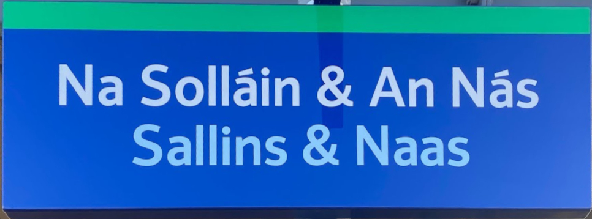
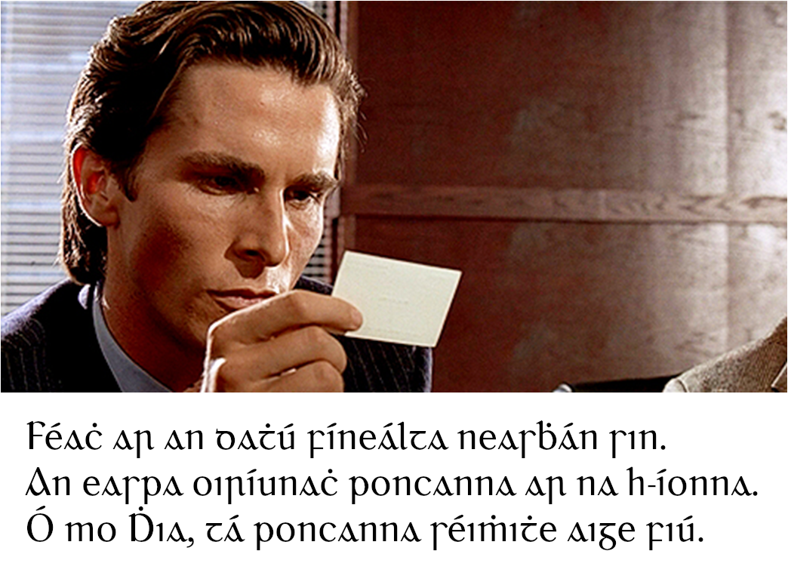

+++
title = 'Moaning About the Typography of Irish Text on Train Station Signs'
date = 2024-11-12
tags = ["article", "typefaces", "Gaeilge", "Moaning"]
+++

If you've ever gotten an Iarnród Éireann train from anywhere west of Portarlington to Dublin, you'll have passed through a railway station named "Sallins & Naas".
It gets its unusual name from the fact that despite being located in a small-ish town called Sallins, it is a short distance from & serves the much larger town of Naas, which is the largest town in County Kildare[^1].
If you're like me, that is, have an interest in Gaelic typography and have nothing better to do with your time than get mildly annoyed over trivial matters like typography, you'll find the station name-board particularly offensive to the eye:

Horrifying, isn't it?

I shan't complain about the ugly font & colours, as this seems to be a standard choice across Iarnróid Éireann stations, and I can forgive the weirdly cramped *síneadh fada*, distasteful as it may be.
The presence of [tittles](https://en.wikipedia.org/wiki/Tittle) on the *I*s is where I really begin to take issue: traditionally, Gaelic orthography excludes the tittle, and so too did Irish road signs up until the utterly tasteless decision was made to start dotting the *I*s[^2].
However, my primary issue is with the use of the ampersand in the Irish text: the Irish alphabet does not include the ampersand, and "⁊" is used instead.
This symbol is called the *Tironian Et* in English or more simply the *agus* (literally "and") in Irish.
While my complaint about the presence of tittles could be reasonably dismissed by saying that it's simply an alternative typeface rendering and is consistent with the Roman type used to write Irish as opposed to the Gaelic type, the inclusion of an ampersand cannot be dismissed so easily;
including the ampersand is to insert a foreign character that has no historical basis in Irish writing, displacing an ancient character that is firmly rooted in Irish writing history.
It's not as though this character is esoteric or unknown: it was included on Irish road signs for decades, although it seems to be slowly being phased out by sign-makers who have no regard for the Irish language or culture.

This is particularly heartbreaking to see if you've seen what the sign looked like in the past:

]")

This is what Irish-language signs should be: high-contrast, easily-legible colours, clear visual distinction between the Irish & English text by using clearly distinct typefaces, using a traditional Cló Gaelach with dotless *I*s and *poncanna séimhithe* instead of using the letter *H* to denote lenition.
It's simply more practical, more aesthetically pleasing, and more culturally & linguistically enriching.
It should now be easier than ever to produce signs like this, with modern printing & graphic design, and computers effortlessly supporting innumerable scripts & typefaces, but somehow we're moving backwards.

You may, quite reasonably, ask "why does it matter how the Irish text is written?".
My response is simple: what is the point of including the Irish text?
If it's to preserve the Irish language & culture, then why would you not do it properly?
The traditional Irish writing system is as much a part of the Irish language as any other aspect of its orthography. 
Why is one important but not the other?
Why do we give precedence to the English typeface instead of the Irish?
In this day & age, there's no technical restriction on the fonts that can be used on a sign.
If the Irish language matters enough to be included on the sign, then it matters enough to write it properly.

I'll leave you with another minor complaint before ending off this moanfest:
if you return eastwards on the train from Sallins, you'll pass through Athlone Station, where in the car park you'll see a sign misspelling the name of the town in Irish as *Átha Luain*[^3].
Irish signage still has a long way to go.

[^1]: The station was originally simply named "Sallins" from its opening in 1846 to its closure in 1963, before re-opening as "Sallins & Naas" in 1994. I am personally of the opinion that the former name makes more sense.

[^2]: Beyond just being another careless blow dealt to the Irish language & culture, the addition of the tittle to Irish text on road signs serves to make the Irish text less visually distinct from the English than it formerly was, and in my opinion, makes the entire sign less aesthetically pleasing.
This change occurred at some point between the publication of the [1996 version of the Department of Transport Traffic Signs Manual § 2 Directional Information Signs National, Regional and Local Roads](https://dttassupportoffice.sharepoint.com/sites/DTTASSupportOffice/Traffic%20Signs%20ManualTTM/Forms/AllItems.aspx?id=%2Fsites%2FDTTASSupportOffice%2FTraffic%20Signs%20ManualTTM%2F01.%20Traffic%20Signs%20Manual%201996%2F2%20-%20Directional%20Information%20Signs.pdf&parent=%2Fsites%2FDTTASSupportOffice%2FTraffic%20Signs%20ManualTTM%2F01.%20Traffic%20Signs%20Manual%201996&p=true&ga=1)
and the publication of the [2021 version of the Department of Transport Traffic Signs Manual § 2 Directional Information Signs National, Regional and Local Roads](https://dttassupportoffice.sharepoint.com/sites/DTTASSupportOffice/Traffic%20Signs%20ManualTTM/Forms/AllItems.aspx?id=%2Fsites%2FDTTASSupportOffice%2FTraffic%20Signs%20ManualTTM%2FWebsite%2FLive%20documents%2FCurrent%20Chapters%20%28Feb%202024%29%2FChapter%202%20-%20Master%20%28November%202021%29.pdf&parent=%2Fsites%2FDTTASSupportOffice%2FTraffic%20Signs%20ManualTTM%2FWebsite%2FLive%20documents%2FCurrent%20Chapters%20%28Feb%202024%29&p=true&ga=1), with dotless *I*s appearing in the former but not the latter.
Unfortunately, at the time of writing, the Department of Transport has not made the interim versions of the Traffic Sign Manual available online, but I would estimate that the change probably occurred in the 2010 TSM, as [this thread from 2007 on SABRE](https://www.sabre-roads.org.uk/forum/viewtopic.php?t=14547) refers to a version of the road signs with dotless *I*s as the most recent version, which is the latest reference I can find to *all* Irish road signs featuring dotless *I*s.

[^3]: This is an easy enough spelling mistake to make for someone with a weak grasp of the Irish language.
"Athlone Town" is *Baile Átha Luain* in Irish, which can be literally translated as "The town of the ford of Luan".
This "of" relationship between two words in Irish is represented by putting the word which owns the other in the *genitive form*.
The word "town" (*baile*) is shown to be "of" the ford in question by changing the spelling of the word for "ford" from the nominative *Áth* to the genitive *Átha*.
The same is done for the name Luan: to show that it is the town of the ford **of Luan**, the spelling of his name is changed to the genitive *Luain*.
   
However, if you just want to write "Athlone" and not "Athlone Town", then it is simply *Áth Luain* and not *Átha Luain*.
Writing *Átha Luain* is like writing "of the ford of Luan" instead of "the ford of Luan" in English: if you remove the *baile* from the name, then you need to revert the spelling of the word "ford" back to its nominative form from the genitive, as the spelling *Átha*.

